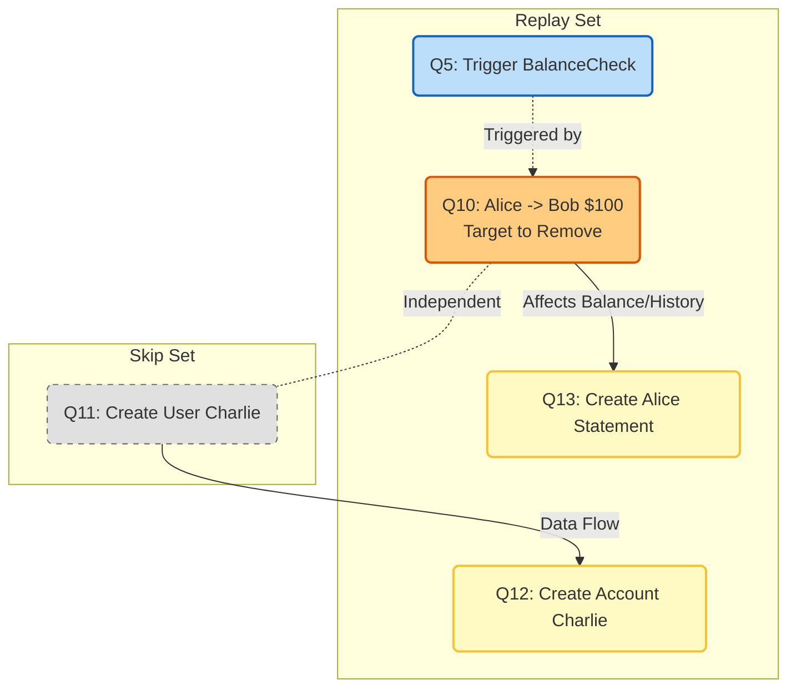
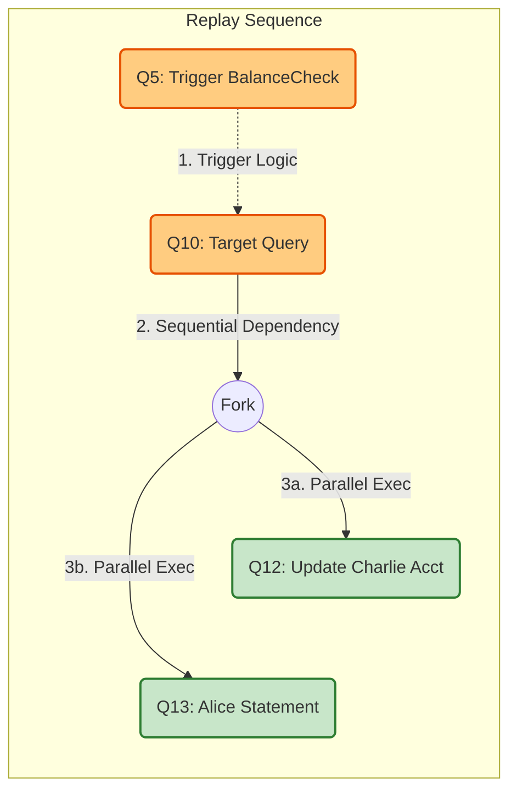
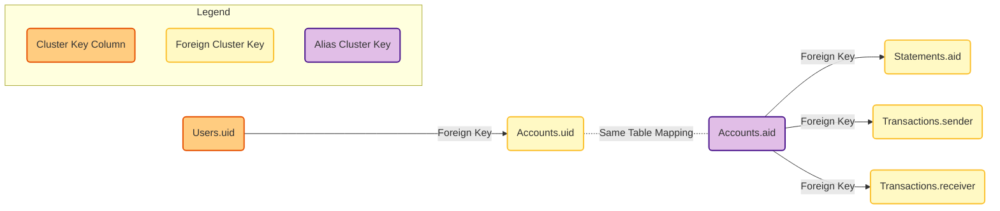
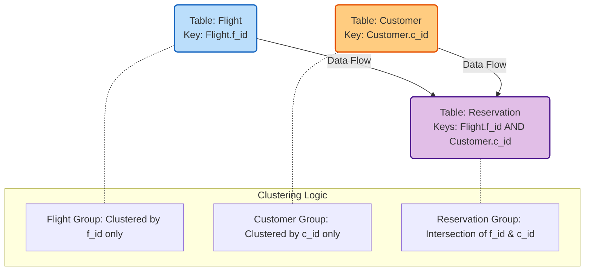

**Abstract**

Retroactive operation is an operation that changes a past operation in a series of committed ones (e.g., cancelling the past insertion of '5' into a queue committed at $t=3$). Retroactive operation has many important security applications such as attack recovery or private data removal (e.g., for GDPR compliance). While prior efforts designed retroactive algorithms for low-level data structures (e.g., queue, set), none explored retroactive operation for higher levels, such as database systems or web applications. This is challenging, because: (i) SQL semantics of database systems is complex; (ii) data records can flow through various web application components, such as HTML's DOM trees, server-side user request handlers, and client-side JavaScript code. We propose Ultraverse, the first retroactive operation framework comprised of two components: a database system and a web application framework. The former enables users to retroactively change committed SQL queries; the latter does the same for web applications with preserving correctness of application semantics. Our experimental results show that Ultraverse achieves 10.5x~693.3x speedup on retroactive database update compared to a regular DBMS's flashback & redo.

# 1 Introduction

Modern web application services are exposed to various remote attacks such as SQL injection, cross-site scripting, session hijacking, or even buffer overflows [25, 29, 39]. To recover from the attack damages, the application code often needs to be reconfigured or patched, and the application's state polluted by the attack has to be retracted. Retroactive operation is particularly important, especially for the service that hosts many users and manages their financial assets, because their financial data may have been affected by the attack and put into invalid state.

Concretely, Figure 1 shows an example of an online banking web server's user request handler that transfers money from one user's account to another. The server queries the Accounts table to check if the sender has enough balance; if so, the server subtracts the transferring amount from the sender's balance and adds it to the receiver's balance. But suppose that some SendMoney request was initiated by a remote attacker (e.g., via request forgery or session hijacking). This will initially corrupt the server's Accounts table, and as time flows, its tampered data will flow to other tables and put the entire database into a corrupted state. To recover the database to a good state, the most naive and intuitive solution is the following steps: (1) roll back the database to just before the SQL query's commit time of the malicious user request; (2) either skip the malicious query or sanitize its tampered amount to a benign value; (3) replay all subsequent queries. But this naive solution suffers two problems: efficiency and correctness.

```javascript
1: function SendMoney (sender, receiver, amount):
2:
3:     var sender_balance = SQL_exec("SELECT balance
4:                                    FROM Accounts WHERE id=" + sender)
5:
6:     if (sender_balance > amount):
7:
8:         sender_balance -= amount
9:
10:        SQL_exec("UPDATE Accounts SET balance = "
11:                 + sender_balance + " WHERE id = " + sender)
12:
13:        SQL_exec("UPDATE Accounts SET balance = balance "
14:                 + " + " + amount + " WHERE id = " + receiver)
```

*Figure 1: An online banking server's money transfer handler.*

* **Efficiency:** It is critical for any financial institution to investigate an attack and resume its service in the shortest possible time, because every second of the service downtime is its financial loss. Provided this, performing naive rollback & replay of all past queries is an inefficient solution. In fact, it would be sufficient to selectively rollback & replay only those queries whose results are affected by the problematic query. Unfortunately, no prior work has proposed such a more efficient database rollback-fix-replay technique covering all types of SQL semantics (i.e., retroactive database system).
* **Correctness:** Even if there existed an efficient retroactive database system, this would not provide the correctness of the application state. This is because replaying only database queries does not replay and re-reflect what has occurred in the application code, which can lead to incorrect database state from the application semantics. In Figure 1, the SendMoney handler is essentially an application-level transaction comprised of 3 SQL queries: SELECT, UPDATE1, and . Among them,  takes sender_balance as an input dynamically computed by the application code (line 5). If we only rollback-fix-replay the SQL logs of the DB system, this will not capture the application code's sender_balance variable's new value that has to be recomputed during the replay phase, and will instead use the stale old value of sender_balance recorded in the prior UPDATE query's SQL log.

Since there exists no automated system-level technique to retroactively update both a database and application state, most of today's application service developers use a manual approach of handcrafting compensating transaction [55], whose goal is to bring in the same effect of executing retroactive operation on an application service. However, as a system's complexity grows, ensuring the correctness of compensating transactions is challenging [44], because their dependencies among SQL queries and data records become non-trivial for developers to comprehend. In the SQL level, although materialized views [9] can reflect changes in their base tables' derived computations, they cannot address complex cases such as: (i) views have circular dependencies; (ii) computations derived from base tables involve timely recurring queries [36]. Indeed, major financial institutions have suffered critical software glitches in compensating transactions [58].

Some traditional database system techniques are partially relevant to addressing these issues: temporal or versioning databases [32, 37] can retrieve past versions of records in tables; database provenance [34] traces lineage of data records and speculates how a query's output would change if inputs to past queries were different; checkpoint and recovery techniques [59] rollback and replay databases by following logs; retroactive data structure [17] can retroactively add or remove past actions on a data object. Unfortunately, all existing techniques are problematic. First, their retroactive operations are either limited in functionality (i.e., supports only a small set of SQL semantics, without supporting TRIGGER or CONSTRAINT, for example) or inefficient (i.e., exhaustive rollback and replay of all committed queries). Second, no prior arts address how to perform retroactive operations for web applications which involve data flows outside SQL queries- this includes data flows in application code (e.g., webpage's DOM tree, client's JavaScript code, server's user request handler) as well as each client's local persistent storage/databases besides the server's own database.

To address these problems, we propose Ultraverse, which is composed of two components: a database system and a web application framework. The Ultraverse database system (§3) is designed to support efficient retroactive operations for queries with full SQL semantics. To enable this, Ultraverse uses five techniques:
(i) it records column-wise read/write dependencies between queries during regular service operations and generates a query dependency graph;
(ii) it further runs row-wise dependency analysis to group queries into different clusters such that any two queries from different clusters access different rows of tables, which means the two queries are mutually independent and unaffected;
(iii) it uses the dependency graph to roll back and replay only those queries dependent to the target retroactive query both column-wise and row-wise;
(iv) during the replay, it runs multiple queries accessing different columns in parallel for fast replay;
(v) it uses Hash-jumper which computes each table's state as a hash (to track its change in state) upon each query commit and uses these hashes to decide whether to skip unnecessary replay during retroactive actions (i.e., when it detects a table's hash match between the regular operation and the retroactive operation).
Importantly, Ultraverse is seamlessly deployable to any SQL-based commodity database systems, because Ultraverse's query analyzer and replay scheduler run with an unmodified database system.

The Ultraverse web application framework (§4) is designed to retroactively update the state of web applications whose data flows occur both inside and outside the database, with support of all essential functionalities common to modern web application frameworks. The Ultraverse framework provides developers with a uTemplate (Ultraverse template), inside which they define the application's user request handlers as SQL PROCEDURES. The motivation of uTemplate is to enforce all data flows of the application to occur only through SQL queries visible to the Ultraverse database. Using uTemplate also fundamentally limits the developers' available persistent storage to be only the Ultraverse database. During regular service operations, each client's user request logs are transparently sent to the server whenever she interacts with the server. The server replays these logs to mirror and maintain a copy of each client's local database, with which the server can retroactively update its server-side database even when all clients are offline. uTemplates are expressive enough to implement various web application logic (e.g., accessing the DOM tree to read user inputs and display results on the browser's screen). Apper (application code generator) converts each uTemplate into its equivalent application-level user request handler and generates the final application code for service deployment.

We have implemented Ultraverse and compared its speed to MariaDB's rollback & replay after retroactive database update (§5). Ultraverse achieved 10.5x~693.3x speedup across various benchmarks. We also evaluated Ultraverse on popular open-source web services (InvoiceNinja [15]) and machine-learning data analytics (Apache Hivemall [30]), where Ultraverse achieved 333.5x~695.6x speedup in retroactive operation. As a general-purpose retroactive database system and web framework, we believe Ultraverse can be used to fix corrupt states or simulate different states (i.e., what-if analysis [19]) of various web applications such as financial service, e-commerce, logistics, social networking, and data analytics.

**Contributions.** We make the following contributions:

* Designed the first (efficient) retroactive database system.
* Designed the first web application framework that supports retroactive operation preserving application semantics.
* Developed and evaluated Ultraverse, our prototype of retroactive database system and web application framework.


## 2 Overview

**Problem Setup:** Suppose an application service is comprised of one or more servers sharing the same database, and many clients. An attacker maliciously injected/tampered with an SQL query (or an application-level user request) of the application service, which made the application's database state corrupted. All application data to recover are in the same database. We identified the attacker-controlled SQL query (or user request) committed in the past.

**Goal:** Our goal is to automatically recover the application's corrupted database state, by retroactively removing or sanitizing the attacker-controlled SQL query (or user request) committed in the past. This goal should be achieved:
* (i) efficiently by minimizing the recovery delay;
* (ii) correctly not only from the low-level SQL semantics, but also from the high-level application semantics.

**Retroactive Operation:** Consider a database $D$, a set $\mathbb{Q}$ of queries $Q_i$ where $i$ represents the query's commit order (i.e., query index), and $Q'_{\tau}$ is the target query to be retroactively added, removed, or changed at the commit order $\tau$ within $\{Q_{1},Q_{2},...Q_{\tau}...Q_{|\mathbb{Q}|}\}=\mathbb{Q}$.

* In case of retroactively **adding** a new query $Q$, $Q'_{\tau}$ is to be inserted (i.e., executed) right before $Q_{\tau}$.
* In case of retroactively **removing** the existing query $Q_{\tau}$ (i.e., $Q'_{\tau}=Q_{\tau}$), $Q_{\tau}$ is to be simply removed in the committed query list.
* In case of retroactively **changing** the existing query $Q_{\tau}$ to $Q'_{\tau}$, $Q_{\tau}$ is to be replaced by $Q'_{\tau}$.

The retroactive operation on the target query $Q'_{\tau}$ is equivalent to transforming $D$ to a new state that matches the one generated by the following procedure:

1.  **Rollback Phase:** roll back $D$'s state to commit index $\tau-1$ by rolling back $Q_{|\mathbb{Q}|}, Q_{|\mathbb{Q}|-1}, ... Q_{\tau+1}, Q_{\tau}$.
2.  **Replay Phase:** do one of the following:
    * To retroactively **add** $Q'_{\tau}$, execute $Q'_{\tau}$ and then replay $Q_{\tau}, ... Q_{|\mathbb{Q}|}$.
    * To retroactively **remove** $Q'_{\tau}$, replay $Q_{\tau+1}, ... Q_{|\mathbb{Q}|}$.
    * To retroactively **change** $Q_{\tau}$ to $Q'_{\tau}$, execute $Q'_{\tau}$ and then replay $Q_{\tau+1}, ... Q_{|\mathbb{Q}|}$.

Instead of exhaustively rolling back and replaying all $Q_{\tau}...Q_{|\mathbb{Q}|}$, Ultraverse picks only those queries whose results depend on the retroactive target query $Q'_{\tau}$. To do this, Ultraverse analyzes query dependencies based on the read and write sets of each query. Our proposed granularity for expressing the read and write sets is table columns, the finest database granularity we can obtain from query statements only. Also, we will consider the effect of schema evolution including TRIGGER creation/deletion, as well as TRANSACTION or PROCEDURE which binds and executes multiple queries together.

## 3 Ultraverse's Database System

```mermaid
flowchart TD
    %% Define Styles
    classDef default fill:#f9f9f9,stroke:#333,stroke-width:1px;
    classDef db fill:#e1f5fe,stroke:#01579b,stroke-width:2px;
    classDef ultra fill:#fff3e0,stroke:#ff6f00,stroke-width:2px,stroke-dasharray: 5 5;
    classDef note fill:#fff,stroke:none;

    %% Client Operations
    subgraph Clients [Clients]
        RegClient(Client: Regular Query Operation)
        RetroClient(Client: Retroactive Operation)
    end

    %% DB System (Unmodified)
    subgraph DBSystem [DB System]
        direction TB
        Core[Parser / Optimizer / Executor]
        QLog[(Query Log)]
    end
    class DBSystem db

    %% Ultraverse Component
    subgraph Ultraverse [Ultraverse Query Analyzer]
        direction TB
        QALog[Query Analysis Log]
        HJ[Hash Jumper]
        Sched[Redo Scheduler]
    end
    class Ultraverse ultra

    %% Regular Flow (Blue/Solid)
    RegClient --"1 query"--> Core
    Core --"2 record"--> QLog
    Core --"3 result"--> RegClient
    QLog --"2-a silently read"--> QALog

    %% Retroactive Flow (Red/Dotted)
    RetroClient -.-"1 command"-> Ultraverse
    Ultraverse -.-"4 completion"-> RetroClient
    
    %% Internal Ultraverse Flow
    QALog -.-"create dependency graph"-> Sched
    QALog -.-"monitor hashes"-> HJ
    HJ -.-"notify hash hits"-> Sched
    Sched -.-"3 replay"-> Core

    %% Links for Layout
    linkStyle 0,1,2,3 stroke:blue,stroke-width:2px;
    linkStyle 4,5,6,7,8,9 stroke:red,stroke-width:2px,stroke-dasharray: 5 5;
```
Figure 2: The Ultraverse database system’s architecture.

Figure 2 depicts Ultraverse's database architecture. At a high level, Ultraverse's query analyzer runs with a unmodified database system. While the database system serves a user's regular query requests and records them to the query log, Ultraverse's query analyzer reads the query log in the background and records two additional pieces of information: (a) read-write dependencies among queries, (b) the hash values of each table updated by each committed query.

When a user requests to retroactively add, remove, or change past queries, Ultraverse's query analyzer analyzes the query dependency log and sends to the database system the queries to be rolled back and replayed. Ultraverse's replay phase executes multiple non-dependent queries in parallel to enhance the speed, while guaranteeing the final database state to be strongly serialized (as if all queries are serially committed in the same order as in the past).


## 3.1 A Motivating Example


Figure 3: Online banking service’s query dependency graph.

Figure 3 is a motivating example of Ultraverse's query dependency graph for an online banking service, comprised of 4 tables and 1 trigger.

### **Database Schema**
* **Users:** Stores each user's `id` and `social security number`.
* **Accounts:** Stores each user's `account number` and its `current balance`.
* **Transactions:** Stores each record of money transfer as the tuple of the sender & receiver's account numbers and the transfer amount.
* **Statements:** Stores each account's monthly transactions history.
* **BalanceCheck (Trigger):** Checks if each account has an enough balance before sending out money.

### **Scenario Timeline**
1.  **Initialization:** The service creates the tables (`Users`, `Accounts`, `Transactions`, `Statements`) and the `BalanceCheck` trigger (Q1~Q5).
2.  **User Onboarding:** Alice and Bob's user IDs and accounts are created (Q6~Q9).
3.  **The Attack (Target Query):** Alice's account transfers $100 to Bob's account (Q10).
    * *Context:* Suppose that Q10 turns out to be an attacker-controlled money transfer and the service needs to retroactively remove it.
4.  **Innocent Activity:** Charlie creates his ID and account (Q11~Q12).
5.  **Reporting:** Alice's monthly bank statement is created (Q13).

### **Ultraverse's Optimization Goal**
Ultraverse's 1st optimization goal is to **rollback & replay only Q5, Q10, Q12, and Q13**, skipping Q11.
* **Reason for skipping Q11:** The columns that Q11 reads/writes (`Users.*`) are unaffected by the retroactively removed Q10.


## 3.2 Column-wise Read/Write Dependency

Table A (referenced below) shows all types of SQL queries that Ultraverse supports for query dependency analysis. In the table, each query has a read set ($R$) and a write set ($W$), which are used to deduce query dependencies.

* **Read Set ($R$):** A list of columns of tables/views that the query reads during execution.
* **Write Set ($W$):** A list of columns of tables/views that the query updates during execution.

### **Key Policies & Remarks**
Besides the standard definitions, Ultraverse applies the following rules for specific scenarios:

* **Schema & Constraints:** The $R/W$ set policy for `CREATE/ALTER TABLE` is applied in the same manner for creating/altering `CONSTRAINT` or `INDEX`.
* **Dynamic Foreign Keys:** If an `ALTER TABLE` query dynamically adds a `FOREIGN KEY` column to some table, the $R/W$ set policy associated with this newly added column is applied only to those queries committed *after* this `ALTER TABLE` query.
* **Updatable Views:** If a query `INSERT`, `UPDATE` or `DELETE` a view, the original table/view columns this view references are cascadingly included in the query's $W$ set.
* **Branch Conditions (Control Flow):** It is difficult to statically predict which direction of a conditional branch (in a PROCEDURE, TRANSACTION, or TRIGGER) will be explored during runtime.
    * **Strategy:** Ultraverse assumes that each conditional branch explores **both directions** (i.e., merges the $R/W$ sets of the true and false blocks).
    * **Trade-off:** This leads to an over-estimation of $R/W$ sets (potentially larger dependency graph), but ensures the correctness of retroactive operation.

### **Table A: Policy for Generating R/W Sets**
*Based on Appendix Table A *

| Query Type | Read Set ($R$) Policy | Write Set ($W$) Policy |
| :--- | :--- | :--- |
| **CREATE / ALTER TABLE** | Columns of external tables (or views) this query's `FOREIGN KEYS` reference. | All columns of the table (or view) to be created or altered. |
| **DROP / TRUNCATE TABLE** | - | All columns of the target table + all external tables' `FOREIGN KEY` columns that reference this target table. |
| **CREATE VIEW** | All columns of the original tables (or views) this view references. | All columns of the target view to be created. |
| **DROP VIEW** | - | All columns of the view to be dropped. |
| **SELECT** | Columns accessed in `SELECT` or `WHERE` + External `FOREIGN KEYS` + Union of $R$ of inner sub-queries. | $\emptyset$ (Empty) |
| **INSERT** | Union of $R$ of inner sub-queries + External `FOREIGN KEYS`. | All columns of the target table (or view) this query inserts into. |
| **UPDATE / DELETE** | Union of $R$ of inner sub-queries + Columns of target table read + External `FOREIGN KEYS` + Columns read in `WHERE` clause. | Specific updated columns (or all deleted columns) + all external tables' `FOREIGN KEY` columns referencing them. |
| **CREATE TRIGGER** | Union of $R$ of all queries within it. | Union of $W$ of all queries within it. *(Added to linked queries)*. |
| **TRANSACTION / PROCEDURE** | Union of $R$ of all queries within it (tracks `DECLARE` variables/return values). | Union of $W$ of all queries within it. |


## 3.3 Query Dependency Graph Generation

Ultraverse's query analyzer records the $R/W$ sets of all committed queries during regular service operations. This information is used for retroactive operation: serving a user's request to retroactively remove, add, or change past queries and updating the database accordingly.

Ultraverse accomplishes this by:
1.  Rolling back only those tables accessed by the user's target query and its dependent queries.
2.  Removing, adding, or changing the target query.
3.  Replaying only its dependent queries.

To choose the tables to roll back, Ultraverse creates a **query dependency graph**, in which each node is a query and each arrow is a dependency between queries.

### **Query Dependency Rules**
In Ultraverse, if executing one query could affect another query's result, the latter query is said to depend on the former query. Table 1 defines the specific rules.

**Notations:**
* $Q_n$: $n$-th committed query.
* $\tau$: The retroactive target query's index.
* $T_x$: Query "CREATE TRIGGER $x$".
* $R(Q_n), W(Q_n)$: $Q_n$'s read & write sets.
* $Q_n \to Q_m$: $Q_n$ depends on $Q_m$.
* $Q_n \triangleright T_x$: $Q_n$ is a query that triggers $T_x$.

| Rule | Logic | Description |
| :--- | :--- | :--- |
| **1. Column-wise Dependency** | $\exists c((c \in W(Q_m)) \wedge (c \in (R(Q_n) \cup W(Q_n))) \wedge (m < n) \implies Q_n \to Q_m$ | If $Q_m$ writes to a column and later $Q_n$ reads/writes the same column, then $Q_n$ depends on $Q_m$. *Note: This excludes read-then-write cases because a prior read does not affect a later write.* |
| **2. Transitivity** | $(Q_n \to Q_m) \wedge (Q_m \to Q_l) \implies Q_n \to Q_l$ | Dependencies are transitive. |
| **3. Triggers** | $(Q_n \to Q_\tau) \wedge (Q_n \triangleright T_x) \implies T_x \to Q_\tau$ | If a query dependent on the target triggers $T_x$, then $T_x$ must also depend on the target (to be reactivated during replay). |

### **Key Observations**
* **Foreign Keys:** Red arrows in the dependency graph represent column read-write dependencies caused by `FOREIGN KEY` relationships. If a column's value changes, tables referencing it may be affected, requiring rollback/replay.
* **Read-Only Queries:** The graph omits queries with empty write sets (e.g., `SELECT`), as they do not affect the database state.

## 3.4 Efficient Rollback and Replay


Figure 4: The replay schedule for Figure 3.


Given the query dependency graph, Ultraverse rollbacks and replays only the queries dependent on the target query as follows:

1.  **Rollback Phase:** Rollback each table whose column(s) appears in some read or write set in the query dependency graph. Copy those tables into a temporary database.
2.  **Replay Phase:** Add, remove, or change the retroactive target query as requested by the user. Then, replay (from the temporary database) all the queries dependent on the target query, as much in parallel as possible without harming the correctness of the final database state (i.e., guaranteeing strongly serialized commits).
3.  **Database Update:** Lock the original database and reflect the changes of *mutated tables* from the temporary database to the original database. After done, unlock the original database and delete the temporary database.

### **Table Classification**
During the above process, each table in the original database is classified into one of three types :

* **Mutated Table:** Its column(s) is in the **write set** of at least one dependent query.
* **Consulted Table:** None of its columns is in the write set, but its column(s) is in the **read set** of at least one dependent query.
* **Irrelevant Table:** The table is neither mutated nor consulted.

Ultraverse rolls back both *mutated* and *consulted* tables to their state at the first access time after the retroactive target time. *Consulted tables* must be rolled back because their former states are needed while replaying dependent queries that update mutated tables.

### **Parallel Replay Optimization**
To ensure consistency, the past commit order of dependent queries should be preserved. While a naive approach would re-commit queries serially (which is slow), Ultraverse leverages query dependency information to execute multiple queries **in parallel** if their $R/W$ sets do not overlap.
* **Safety:** Parallel execution is safe because if two queries access different objects, they do not cause a race condition.
* **Result:** This improves replay speed while guaranteeing the same final state as strongly serialized commits.

For example, in the replay schedule (Figure 4), **Q12** and **Q13** are safely replayed in parallel because they access different table columns.

### **Service Availability**
During the retroactive operation, Ultraverse simultaneously serves regular SQL operations from its clients. This is possible because the rollback & replay are done on a **temporarily created database**. The original database is only briefly locked during the final update phase (Step 3) to reflect the delta changes.

### **Replaying Non-determinism**
* **Challenge:** Functions like `CURTIME()` or `RAND()` are non-deterministic.
* **Solution:** Ultraverse records the concretized return value of such functions during regular operations. During the replay phase, it enforces each query to use the same recorded value.
* **New Queries:** For a retroactively *added* query using timing functions, Ultraverse estimates the return value based on the retroactively assigned timestamp.


## 3.5 Row-wise Dependency & Query Clustering


Figure 5: Figure 3's cluster key propagation graph.

While §3.3 described column-wise dependency analysis, Ultraverse also uses row-wise dependency analysis to further reduce the number of queries to rollback/replay.

### **Motivation: The "Alice vs. Charlie" Problem**
Using the example in Figure 3:
* **Column-wise Analysis:** Found that Q12 (Charlie's account creation) depends on Q10 (Alice's transfer) because they touch the same tables (`Users`, `Accounts`).
* **Reality:** Q12 only accesses Charlie's data, while the retroactive target Q10 affects Alice and Bob. Charlie has no interaction with Alice/Bob .
* **Goal:** Classify queries into disjoint clusters based on the table rows they access. Any two queries from different clusters are **row-wise independent** and unaffected by each other.

### **Query Clustering Algorithm**
Ultraverse identifies "Cluster Keys" ($K$) from query statements (`WHERE`, `VALUES`, etc.) and groups queries that share keys.

**Table 2: Query Clustering Rules** 

| Rule | Logic | Description |
| :--- | :--- | :--- |
| **1. Intersection** | $K_c(Q_n) \cap K_c(Q_m) \neq \emptyset \implies Q_n \leftrightarrow Q_m$ | If two queries share at least one cluster key value, they are in the same cluster. |
| **2. Transitivity** | $(Q_m \leftrightarrow Q_n) \wedge (Q_n \leftrightarrow Q_o) \implies Q_m \leftrightarrow Q_o$ | Clustering is recursive until saturation. |
| **3. Independence** | $Q_n \nleftrightarrow Q_m \implies Q_n \nleftrightarrow Q_m$ | If queries are not in the same cluster, they are independent. |

* **Result:** Ultraverse only replays queries that are in the **same cluster** as the retroactive target query ($Q_\tau$). In the example, Q12 is skipped because $K(Q12)=\{\text{'charlie'}\}$ and $K(Q10)=\{\text{'alice', 'bob'}\}$, which have no intersection.

### **Cluster Key Propagation (Figure 5 Logic)**
Effective clustering requires tracking the key across tables. Ultraverse defines three types of keys:

1.  **Cluster Key Column:** The primary column used to identify rows (e.g., `Users.uid`).
2.  **Foreign Cluster Key:** A `FOREIGN KEY` column that references the cluster key (e.g., `Accounts.uid`). Its value directly reflects the origin key.
3.  **Alias Cluster Key:** A column in the same table as a cluster key that maps to it (e.g., `Accounts.aid`).
    * *Example:* If `INSERT INTO Accounts VALUES (aid=0003, uid='charlie')`, then `aid=0003` is mapped to `uid='charlie'`. Future queries using `aid=0003` are treated as having the cluster key `{'charlie'}` .

### **Optimal Cluster Key Selection**
To minimize the number of replayed queries, Ultraverse must choose the best column to serve as the Cluster Key.
* **Choice Rule:** $C_{choice} = \text{argmin}_{c \in C} \sum_{j=t}^{z} |K_c(Q_j)|^2$.
* **Goal:** This formula favors columns that **uniformly distribute** cluster keys across queries (minimizing standard deviation), preventing giant clusters that force unnecessary replays.

### **Advanced Clustering Techniques (§C.6)**
To enable finer-grained clustering, Ultraverse supports:
1.  **Implicit Foreign Keys:** Detecting logical relationships not defined in SQL schema.
2.  **Variable Cluster Keys:** Handling keys defined by SQL variables/functions (verified via static analysis for idempotence).
3.  **Multi-dimensional Keys:** Using multiple columns simultaneously (e.g., `Flight.id` AND `Customer.id`) for complex schemas like SEATS or Epinions.

## 3.6 Hash-Jumper

During a retroactive operation, if we can somehow infer that the retroactive operation will not affect the final state of the database, we can terminate the effectless retroactive operation in advance.

### **Motivation: Effectless Retroactive Operation**
Consider the example in Figure 6:
* **Scenario:** A `Rewards` table tracks user preferences. Alice initially chooses 'mileage' (Q15). Later, she updates it to 'shopping' (Q99).
* **Retroactive Action:** Remove Q15 (the initial choice of 'mileage').
* **Outcome:** When the replay reaches Q99 (Alice sets 'shopping'), the state of the `Rewards` table becomes identical to the state in the original history (since the final value is 'shopping' regardless of whether Q15 existed).
* **Optimization:** Since the state converged at Q99, replaying subsequent queries (Q1000...) is effectless. Hash-Jumper detects this and terminates the process immediately .

### **Mechanism: Compare and Terminate**
Ultraverse computes and logs the hash value of modified table(s) upon each query's commit during regular operations.
1.  **Replay Phase:** Hash-jumper simultaneously runs in the background.
2.  **Detection:** It compares whether the replayed query's output hash value matches its past logged version.
3.  **Termination:** If hash matches are found for all *mutated tables*, Ultraverse terminates the replay and restores the original table states for the remaining timeline .

### **Efficient Table Hashing Algorithm**
To ensure performance, the hash computation time must not depend on the table size.
* **Incremental Hashing:**
    * Initial hash = 0.
    * For each `INSERT`/`DELETE`, compute the hash of the row (e.g., SHA-256).
    * **Add** (for insert) or **Subtract** (for delete) this row hash from the table hash modulo $p$ ($2^{256}$).
* **Complexity:** Constant time with respect to table size; linear in the number of rows modified by the query.
* **Collision Rate:** Upper-bounded by $\frac{1}{p}$ (negligible).

## 3.7 Advanced Query Clustering (Appendix C.6)

To handle complex database schemas where tables cannot be easily separated into disjoint groups, Ultraverse employs advanced clustering techniques.

### **Support for Multiple Cluster Key Columns**
In many real-world scenarios, data flows between tables prevent the formation of simple disjoint groups. To address this, Ultraverse allows the use of **multiple cluster key columns** simultaneously.

* **Concept:** A cluster key is treated as a 2-dimensional tuple: `(Origin Column Type, Value)`.
* **Intersection Rule:** Two queries intersect (and thus belong to the same cluster) only if they share at least one common element where **both** the column type and the value match.
* **Application (SEATS Benchmark Example):**
    * `Flight` table: Clustered by `Flight.f_id`.
    * `Customer` table: Clustered by `Customer.c_id`.
    * `Reservation` table: Receives data from both tables, so it uses **both** `Flight.f_id` and `Customer.c_id` as cluster keys.



Figure 7: Cluster key logic for the SEATS benchmark using multiple keys.

### **Other Advanced Techniques**

* **Implicit Foreign Keys:** Ultraverse detects logical foreign key relationships that exist in the application logic but are not explicitly defined in the SQL schema (e.g., application-level cascades).
* **Variable Cluster Keys:** Using static data flow analysis, Ultraverse validates if SQL variables used as cluster keys are immutable (idempotent) across retroactive operations (e.g., ensuring a variable derived from `RAND()` uses the recorded seed).

